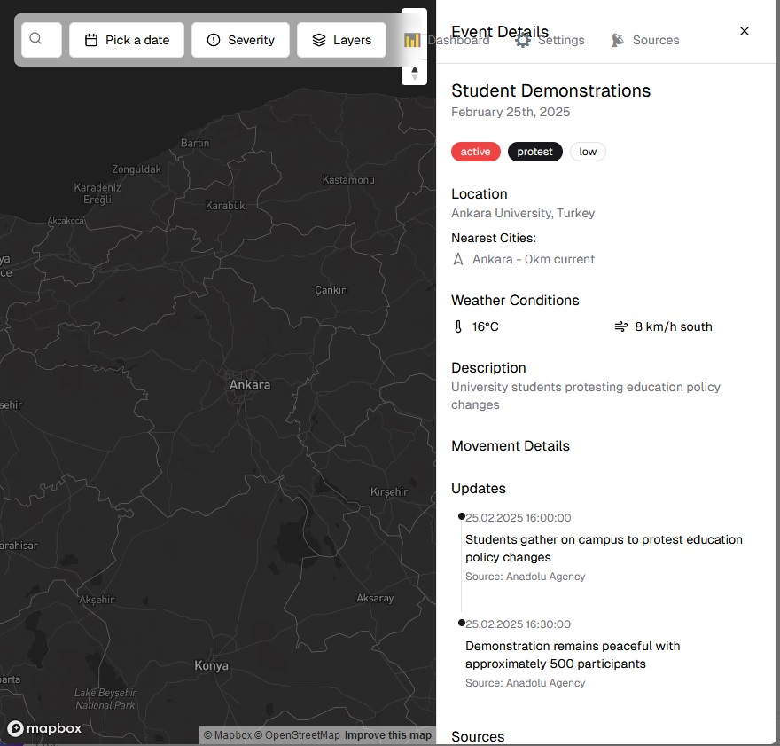
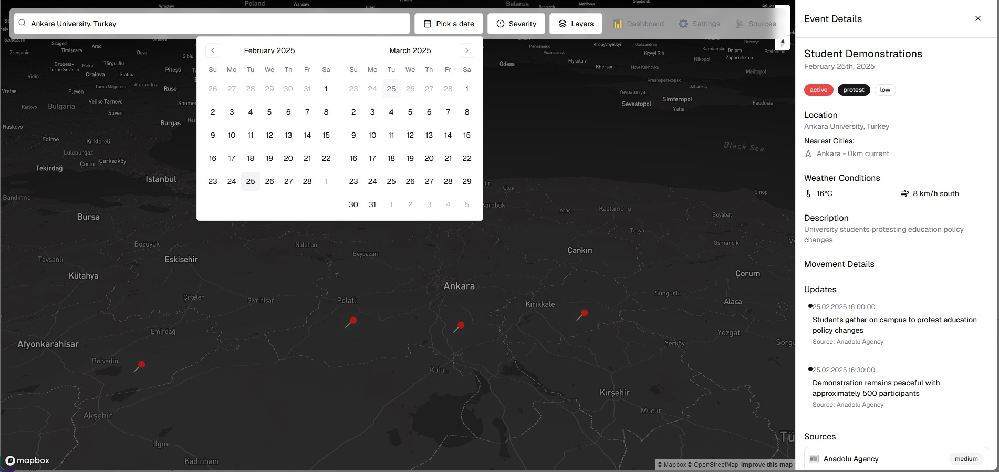
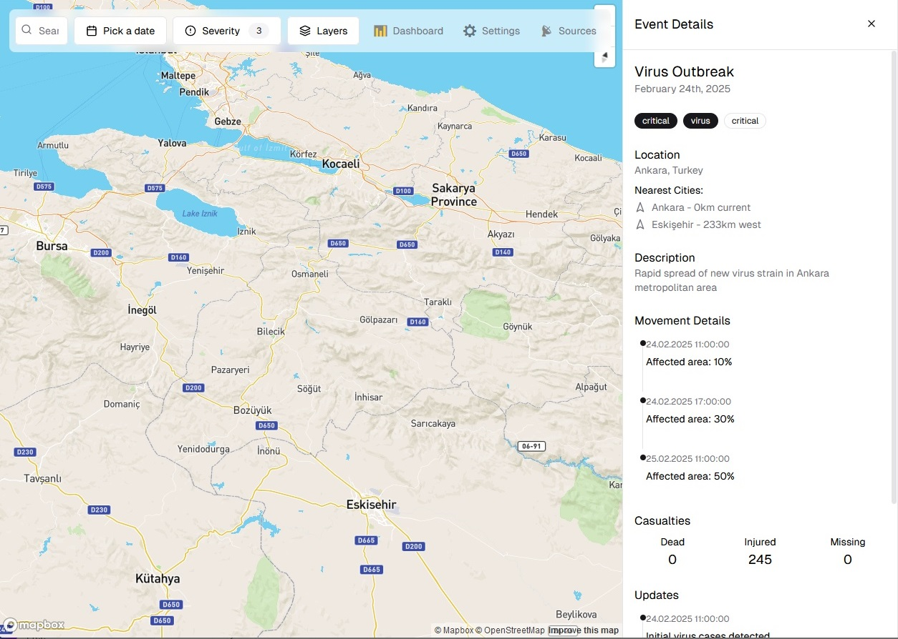
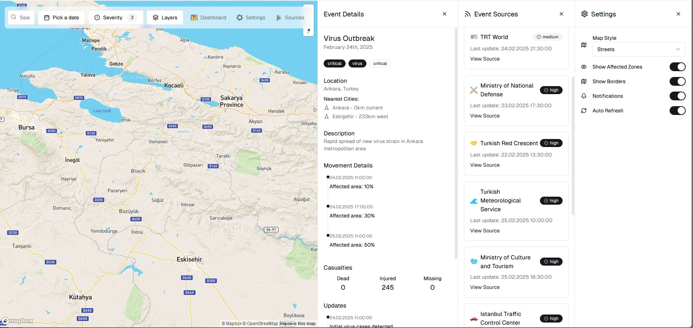
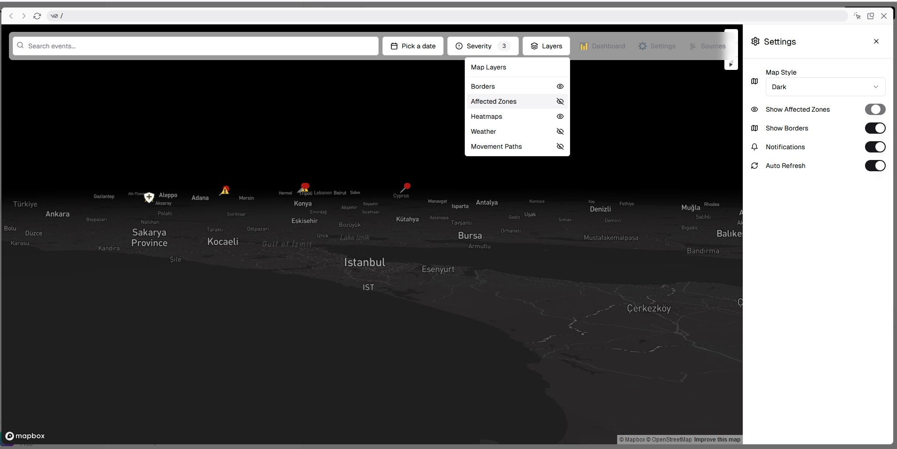
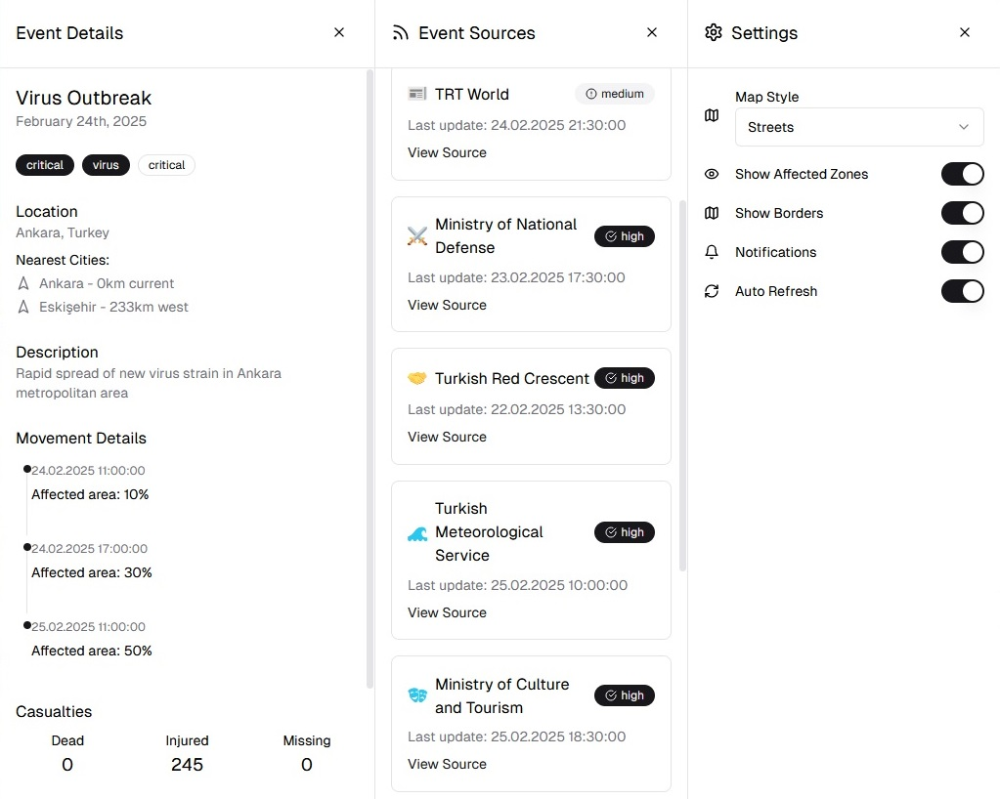

# Lemeye

Lemeye is a sophisticated platform designed to track and visualize real-time events and incidents that occur in Turkey, as well as regional issues like those in Syria. It focuses on critical events such as military movements, virus outbreaks, protests, humanitarian crises, and more. The goal is to provide an interactive map that offers a detailed, dynamic view of real-time and historical event data.

## Project Goals
1. **Real-time Event Tracking**: Track various types of events like military activities, virus spread, protests, humanitarian efforts, and security incidents in Turkey and neighboring regions like Syria.
   
2. **Interactive Map**: The key component is the interactive map, allowing users to visualize events in a geospatial context, including event paths, heatmaps, and real-time updates.

3. **User Engagement**: Includes interactive tools like time sliders, event filters, detailed popups, event timelines, and weather overlays to engage users and allow deep analysis of events.

4. **Data Management**: Handles large amounts of real-time data and visualizes it in an easy-to-understand format from sources like official ministries, news outlets, live updates, and other relevant authorities.

5. **Visualizing Complex Data**: Uses rich, visual indicators like path lines for aircraft, heatmaps for virus spread, progress bars for ongoing events, and dynamic event markers to provide an enriched user experience.

## Core Features
1. **Event Types**:
   - **Military**: Aircraft movements, ground forces, defense operations.
   - **Virus Outbreaks**: Spread of viruses, infection zones, containment areas.
   - **Protests**: Locations of public gatherings, government responses, severity.
   - **Security**: Terrorist attacks, bombings, law enforcement activity.
   - **Humanitarian**: Refugee movements, aid distribution, crises.
   - **Infrastructure**: Natural disasters, building collapses, power outages.

2. **Data Sources**:
   - **Ministry of Defense** (official military updates)
   - **TRT World** (news reports)
   - **AFAD** (disaster and emergency management)
   - **Health Ministry** (virus tracking)

3. **Map Interactivity**:
   - **Markers** to indicate event locations.
   - **Event paths** for military or virus spread (e.g., aircraft flight paths or virus progression).
   - **Heatmaps** to visualize intensity (e.g., virus spread, security threats).
   - **Interactive details** when clicking on events (status updates, descriptions, news, etc.).
   - **Timelines** and **time sliders** to explore how events unfold over time.
   - **Weather data** overlaid on the map to show how weather conditions may affect the event.

4. **User Interface**:
   - **Modern UI/UX** design with a focus on clarity and user engagement.
   - **Event Filter**: Ability to filter events by type, severity, and location.
   - **Real-Time Updates**: Continuous updates to show ongoing events.
   - **Event Dashboard**: A high-level view of the most critical events, with detailed visualizations.

## Development Plan
The project will follow a modular approach, allowing multiple components to be developed independently while maintaining a cohesive design. Here's a broad view of the development process:

### 1. Frontend Development
- **Tools/Tech**: 
   - **React.js** for the component-based frontend.
   - **Next.js** for server-side rendering and static site generation.
   - **Tailwind CSS** for styling.
   - **Map libraries**: **Leaflet.js** or **Mapbox** for building interactive maps.

- **Tasks**:
   - Build interactive maps with event markers and dynamic paths.
   - Implement event filters and timeline features.
   - Add real-time updates from the server.
   - Develop UI components for event details, notifications, and alerts.

### 2. Backend Development
- **Tools/Tech**:
   - **Node.js** with **Express.js** for creating an API.
   - **MongoDB** or **PostgreSQL** for storing event data.
   - **Socket.io** for real-time updates.
   - **Weather APIs** to fetch real-time weather data for affected regions.

- **Tasks**:
   - Develop an API to manage event data.
   - Integrate external data sources using APIs.
   - Implement real-time data handling.
   - Set up data storage and management for historical event data.

### 3. Data Management
- **Tasks**:
   - Event Data Collection from official sources and news organizations in real-time.
   - Ensure that data is updated frequently.
   - Handle large amounts of data and ensure it’s efficiently processed and stored.

## Target Audience
- **Government Agencies**: Emergency management, military, and health agencies for situational awareness and planning.
- **NGOs & Humanitarian Organizations**: To monitor crisis areas and deploy resources effectively.
- **Journalists & News Agencies**: To track ongoing events and generate real-time news reports.
- **General Public**: People who want to stay informed about real-time events, safety updates, and ongoing crises.

## How to Contribute
Contributions are welcome from developers all around the world. Here's how you can get involved:

1. **Fork the Repository**: Start by forking the repository to your GitHub account.
2. **Clone the Repository**: Clone the forked repository to your local machine.
   ```bash
   git clone https://github.com/sonyagit/lemeye.git
   ```
3. **Create a Branch**: Create a new branch for your feature or bug fix.
   ```bash
   git checkout -b feature/your-feature-name
   ```
4. **Make Changes**: Implement your feature or bug fix.
5. **Commit Changes**: Commit your changes with a clear message.
   ```bash
   git commit -m "Add feature: your-feature-name"
   ```
6. **Push Changes**: Push your changes to your forked repository.
   ```bash
   git push origin feature/your-feature-name
   ```
7. **Create a Pull Request**: Open a pull request to the main repository.

For detailed guidelines, please read our [Contributing Guidelines](CONTRIBUTING.md).

## Why Contribute?
Joining the Sonya Foundation community means being part of a vibrant, diverse group of developers who are passionate about using technology to make a difference. By contributing to the Lemeye project, you will:

- **Make an Impact**: Help create a tool that provides critical insights into real-time events affecting Turkey and the region.
- **Collaborate Globally**: Work with developers from around the world and learn from their expertise.
- **Enhance Your Skills**: Gain experience in cutting-edge technologies like React.js, Node.js, and real-time data processing.
- **Build Your Portfolio**: Add a significant open-source project to your portfolio, showcasing your contributions and skills.

## Tech Stack Summary
- **Frontend**: React.js, Next.js, Tailwind CSS, Leaflet.js/Mapbox, TypeScript.
- **Backend**: Node.js, Express.js, MongoDB/PostgreSQL, Socket.io, APIs for weather and external event data.
- **Other Tools**: Git/GitHub for version control, Postman for API testing, Jest for testing.

## Screenshots

### Ankara Students Square


### Ankara Students


### Eskisehir Virus Square


### Eskisehir Virus


### Istanbul Turkiye


### Settings Sources


## Conclusion
The Lemeye project is an ambitious and dynamic platform that will allow users to track a wide range of events in real-time. It combines advanced mapping technology with real-time data processing to provide critical insights into military operations, health crises, and other events affecting Turkey and the region.

With the use of interactive features like heatmaps, real-time updates, and detailed event markers, this project aims to be a powerful tool for both public and official use.

For more information, please contact us at [sonya.foundation@protonmail.com](mailto:sonya.foundation@protonmail.com).

---

Project developed by Turkish and international communities.

[Join Sonya Foundation](https://forms.office.com/r/91yXKuHasm) | [LinkedIn](https://www.linkedin.com/company/sonya-foundation) | [Repository](https://github.com/sonyagit/lemeye)
